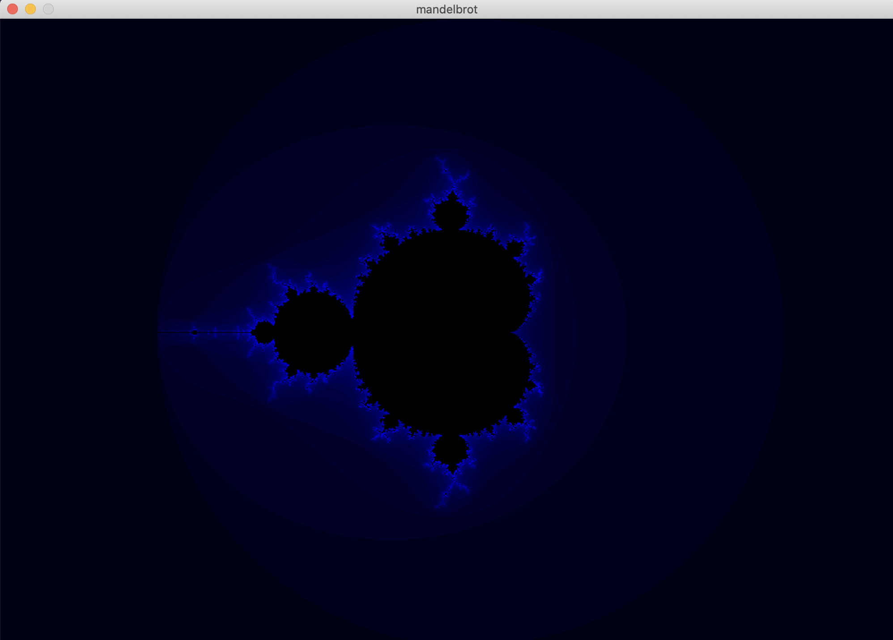
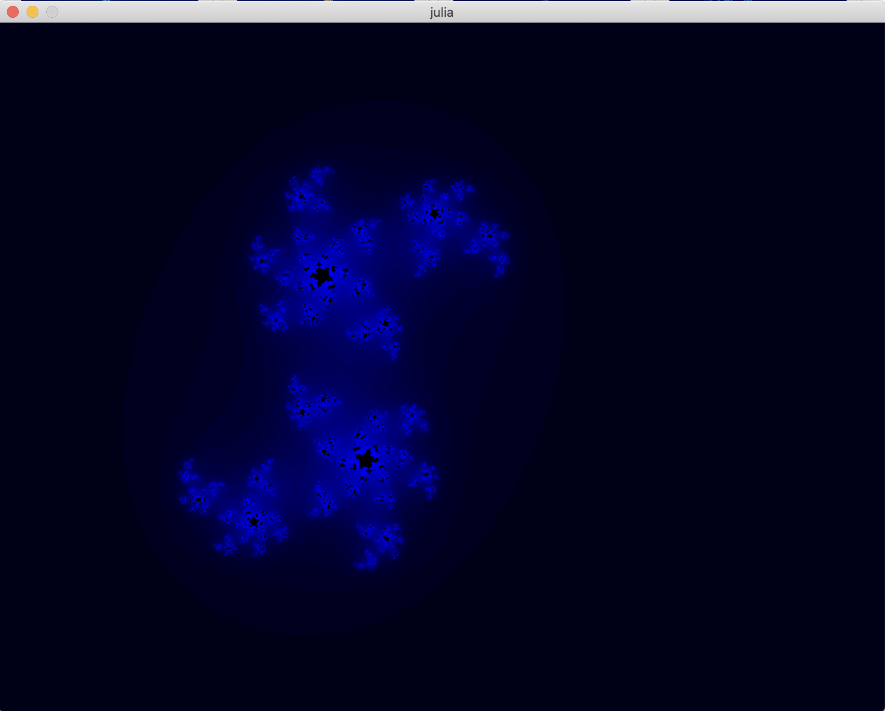

# Fractol
Fract'ol @ 1337 (One of the 42 Network Schools) - multi-threaded fractal renderer



## Table of Contents

- [About](#about)
- [Getting Started](#getting_started)
- [Features](#features)
- [Usage](#usage)

## About <a name = "about"></a>

Fractol is a dynamic project aimed at exploring the fascinating field of fractal geometry. This project harnesses the power of the MinilibX, a simple and easy-to-use library provided by the 42 network, to create stunning graphical representations of various types of fractals. These include the Mandelbrot set, Julia set, and Burning Ship fractal.

## Getting Started <a name = "getting_started"></a>

```
git clone https://github.com/lmakinaa/fractol && cd fractol
make fractol
```
You can now run ```./fractol``` to get started.

### Prerequisites

To run the build and run the program, you'll need:
- Clang
- [MLX](https://github.com/ttshivhula/minilibx)

## Features <a name = "features"></a>

|	  Feature      | Column 2 Header |
|------------------|-----------------|
| Move		       | Arrows          |
| Change color     | C			     |
| Zoom		       | Mouse Wheel     |
| Reset zoom	   | R   		     |
| Exit		       | ESC		     |

## Usage <a name = "usage"></a>

Beside ```./fractol mandelbrot```, you can use:
- ```./fractol julia <reel part> <imaginary part>```

	

- ```./fractol "burning ship"```

	